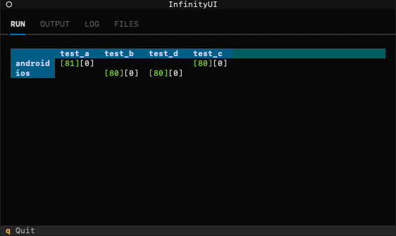

# pytest-infinity

pytest-infinity is a wrapper for [pytest](https://github.com/pytest-dev/pytest), designed to easily command a test session running infinitely using xdist `--dist loadgroup` option.

Below is a demonstration for running tests with an "android" and "ios" group:


Infinity was created for complex low-level test suites in mind for hunting down non-deterministic bugs (running high-level or native tests on multiple mobile devices simultaneously).

These are the main principles of infinity:

- Ease-of-use.
- Test history.
- Infinitely-long sessions.

Infinity uses the following pytest plugins for its functionality:

- [pytest-xdist](https://github.com/pytest-dev/pytest-xdist) - runs tests in parallel.
- [pytest-publish](https://github.com/yuvalino/pytest-publish) - publish live test results to REST and filesystem.
- [pytest-xstress](https://github.com/yuvalino/pytest-xstress) - runs tests infinitely over xdist.

Infinity uses the following plugins for its UI:

- [textual](https://github.com/Textualize/textual) - create UI apps in terminal.
- [rich](https://github.com/Textualize/rich) - rich text for terminals.

PLEASE REPORT BUGS!

## Usage

Just run `infinity <pytest args> ...`

The wrapper adds the following flags implicitly:

```sh
$ pytest --color yes -v 
         -n auto --dist loadgroup
         --xstress
         --publish http://localhost:... <impl defined>
         --pubdir <impl defined>
        
         <pytest args> ...
```

Your pytest args are appended to the end of the cmdline.

## Functions

There are a few useful tabs implemented into infinity:

### RUN

See a matrix of `groups X tests` updated live with [<span style="color:lightgreen">pass</span>][<span style="color:red">fail</span>][<span style="color:yellow">skip</span>] text.



### OUTPUT

Raw stdout output of pytest.


### LOG

Internal log of infinity, with the output directory printed first.


### FILES

Navigatable filesystem with test run info.

